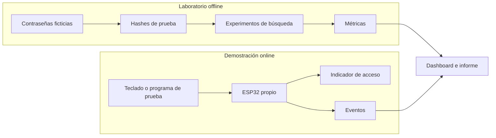
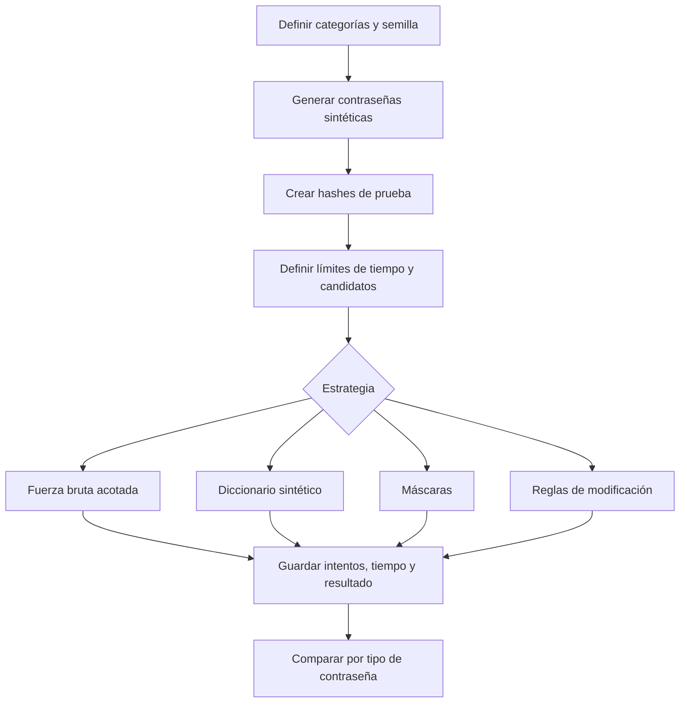
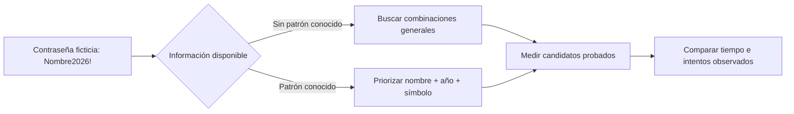
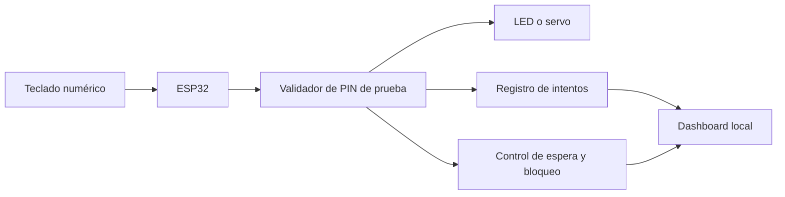
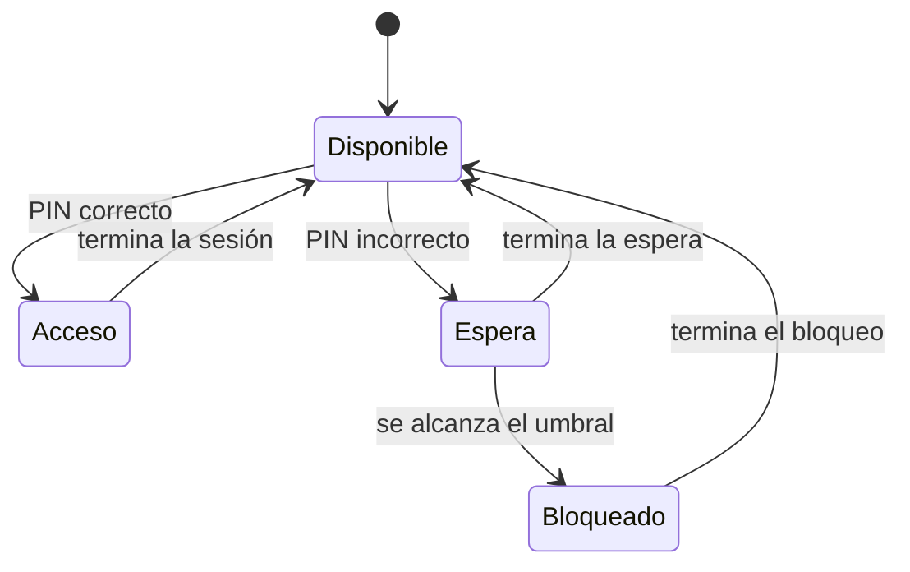
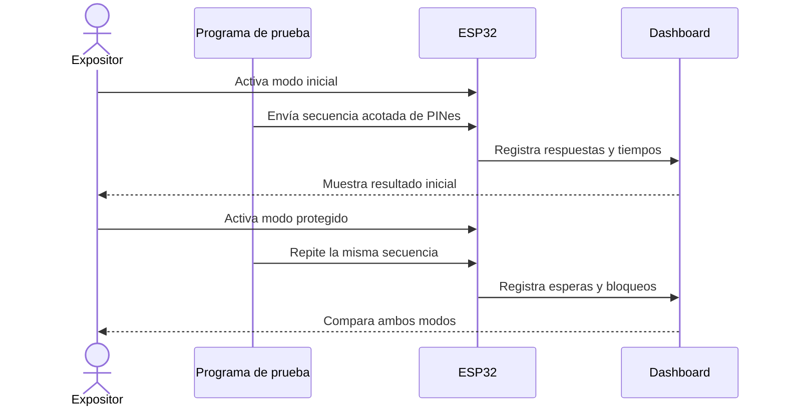
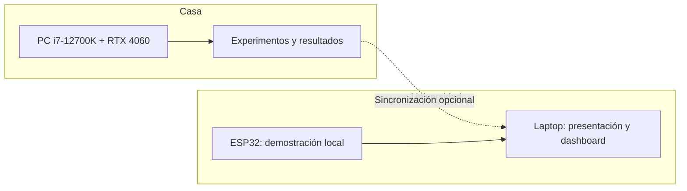
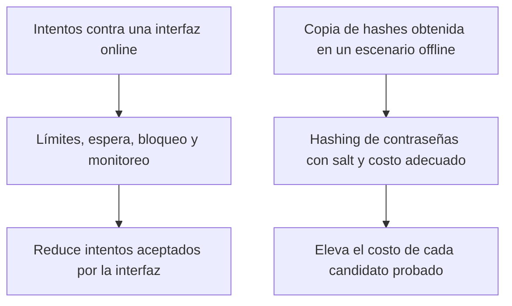

# Diagramas del proyecto

Los diagramas están escritos en Mermaid para que se vean directamente en GitHub y puedan editarse sin instalar programas de dibujo.

También hay [imágenes SVG generadas con los scripts de Python](GALERIA.md) listas para ver y descargar.

## 1. Visión general: cómo se conectan las partes

El laboratorio permite estudiar la **predictibilidad** de una contraseña. El ESP32 permite observar cómo una interfaz de acceso responde a intentos repetidos. El dashboard reúne los resultados sin confundir ambos tipos de prueba.

## 2. Flujo del experimento con contraseñas

Cada estrategia debe usar el mismo conjunto de prueba y límites declarados. Si una prueba no termina, se reporta como **no recuperada dentro del límite**, no como imposible de recuperar.

## 3. Cómo un patrón cambia el orden de búsqueda

Este esquema **no afirma de antemano** un tiempo concreto: explica por qué cambia la prioridad de los candidatos. La conclusión cuantitativa saldrá de las mediciones.

## 4. Componentes del prototipo físico

El LED permite una primera versión simple; el servo y la pantalla pueden añadirse después. El PIN y las pruebas pertenecen exclusivamente al prototipo.

## 5. Estados de la autenticación protegida

En el modo inicial, el dispositivo pasa de un PIN incorrecto a otro intento sin espera. En el modo protegido, se registran el fallo, el retraso y el bloqueo. Los parámetros exactos se fijarán antes de medir y se mostrarán en el informe.

## 6. Secuencia de la demostración en clase

Se repite la misma secuencia para que la diferencia observable se deba al cambio de configuración del dispositivo.

## 7. Ubicación de los equipos y conexión opcional

El proyecto puede presentarse con resultados preparados y la demo ESP32 local. La ejecución remota de nuevos experimentos durante la exposición es opcional y se incorporaría solo después de probar conectividad y permisos.

## 8. Qué defensa actúa en cada escenario

Esta distinción es central para la exposición: limitar el ESP32 no cambia el costo de probar hashes fuera del dispositivo. Para el almacenamiento se evaluará un algoritmo diseñado para contraseñas, como Argon2id.
