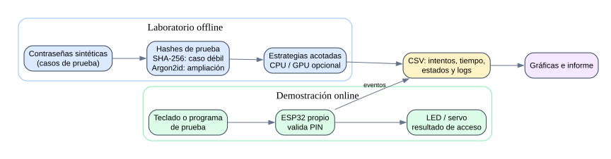
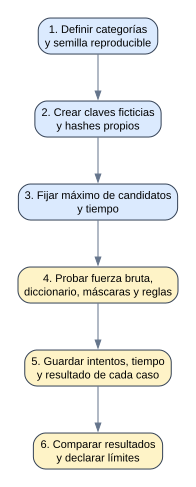
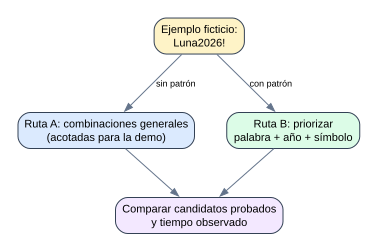
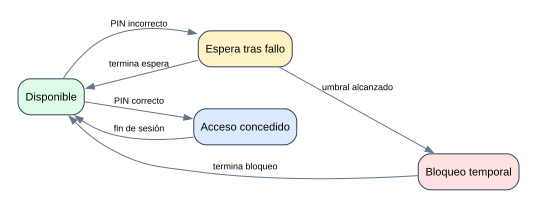
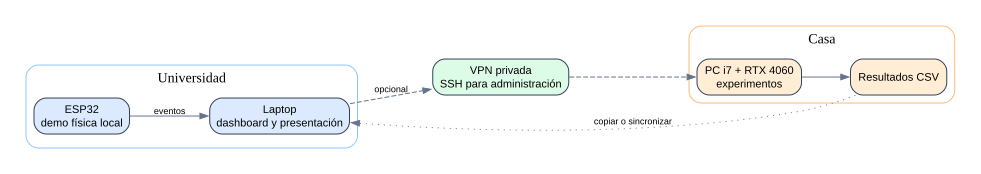
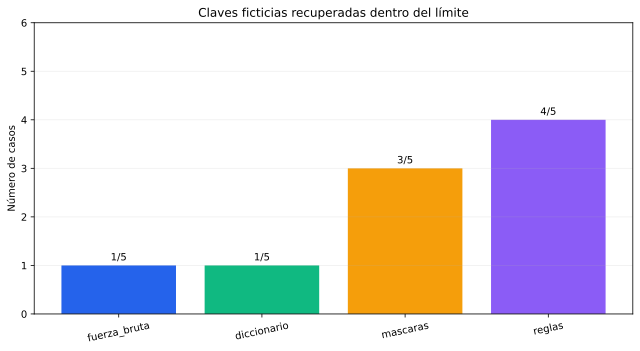
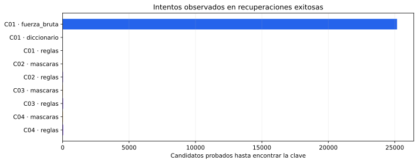
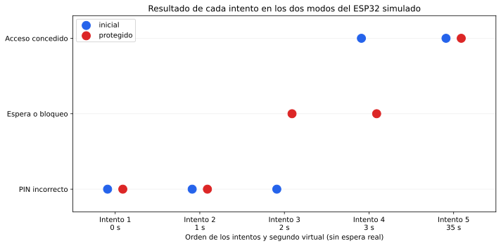

# Galería de diagramas y gráficas

Estas imágenes se generaron ejecutando los scripts Python incluidos en el repositorio. Los **diagramas** representan el diseño previsto. Las **gráficas** usan cinco casos ficticios y un ESP32 simulado; no representan mediciones de hardware real.

## Arquitectura general

## Proceso del experimento offline

## Efecto de conocer un patrón humano

## Estados previstos del ESP32

## Universidad, casa y conexión opcional

## Recuperaciones en la demostración sintética

## Candidatos probados en las recuperaciones

## Dos modos del ESP32 simulado

Consulta [PROCESOS.md](PROCESOS.md) para interpretar cada imagen y [INSTALACION.md](INSTALACION.md) para volver a generarlas.
